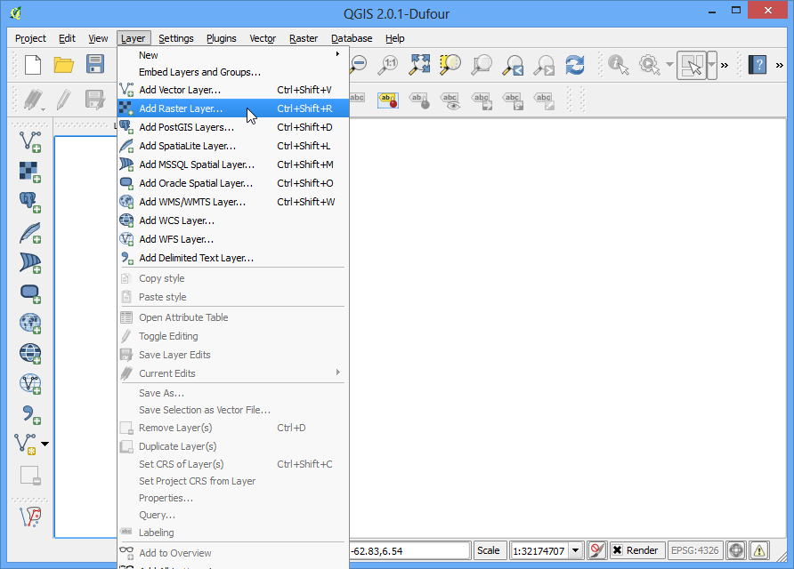
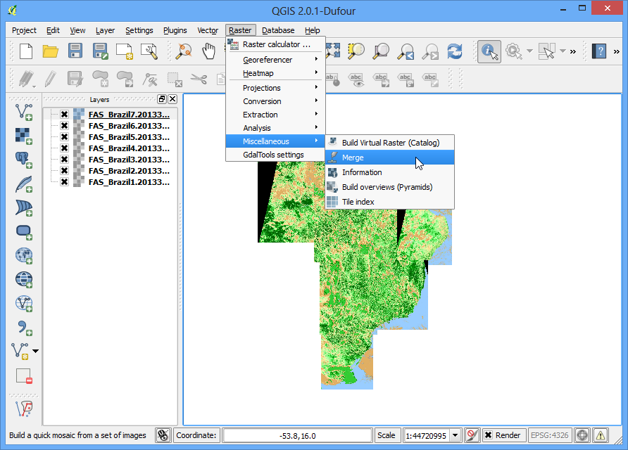

# Lab: Downloading and analyzing the SRTM data

* [Overview](#overview)
* [Data Moaisicing](#DM)

* [Other Courses](#other)

## Overview 
<a id="overview"></a>
DEM data is obtained from many sources. One of the source is SRTM. You can freely download the SRTM data of various resolution. In this lab we will do the following

1. Download the data
    Data is acquired in the rectangular tiles. Please click on [Remote Pixel](https://remotepixel.ca/projects/srtm1arc-gl.html#5.87/62.433/-3.535/-1.2). You can see the individual tiles. Locate Pakistan and see the respective tile information. These tiles do not honor the geographic boundaries. Therefore you need to do the mosaicking and clipping to the shape boundary of the country 
2. Mosaicking of the data by QGIS
3. Analyze and calculate attributes by the ```Whitebox tool```

### Data Mosaicking
<a id="DM"></a>

1. Store the individual tiles in a folder. I have supplied you with individual tiles. Open the QGIS software and click on Layers



1. Navigate to the folder where individual tiles are stored. Select all files and click on open.

2. Then click on *Raster*  :arrow_right: *Miscellaneous*:arrow_right: *Merge*

3. 
$$
  *Raster*  \Rightarrow *Miscellaneous* \Rightarrow  Merge
$$


4. 

5. Bb


### Paper related soft wares
<a id="Papsoft"></a>

1. [PDE-based geophysical modelling using finite elements: examples from 3D resistivity and 2D magnetotelluric](https://launchpad.net/escript-finley)
2. [pyGrav, a Python-based program for handling and processing relative gravity data](https://www.sciencedirect.com/science/article/pii/S009830041630084X)

### Tutorials
<a id=" Tuts"></a>

* [Chapter 5: Land Surveying and GPS](https://www.e-education.psu.edu/natureofgeoinfo/book/export/html/1620)

* [Case Studies](http://computation.geosci.xyz/case-studies/index.html) : Numerical Case studies usin SimPEG
* [BEST PRACTICE IN GRAVITY SURVEYING](https://d28rz98at9flks.cloudfront.net/37202/37202.pdf)

### Softwares
<a id=" Softs"></a>

[Comparison of free geophysics software](https://www.wikiwand.com/en/Comparison_of_free_geophysics_software#/citenotepysit20)
### Thesis
<a id="Ths"></a>

[On the inversion of potential field data: Physical property estimations and model geometry changes](https://macau.uni-kiel.de/servlets/MCRFileNodeServlet/dissertation_derivate_00005626/diss_haase_2014.pdf) : Very good their very readable. Please see chapter 2  and 3
[Application of Satellite Gradiometry and Terrestrial Gravimetry to Identify Regional Stress Anomalies in the North Chilean Subduction System](https://macau.uni-kiel.de/receive/diss_mods_00017677)
[Processing and Inversion of Airborne Gravity Gradient Data](https://macau.uni-kiel.de/receive/diss_mods_00023847)

## Other Courses

<a id="other"></a>
* [ESS 302: Applied Geophysics II (Gravity, Magnetic, Electrical, Electromagnetic and Well Logging)] (https://sustech-ess302.readthedocs.io/en/latest/content/schedule.html): A course based on SimPEG

* [EOSC 450 Potential Fields in Earth and Planetary Science Fall 2005](https://www.eoas.ubc.ca/~mjelline/EOSC4502005.html):It has some useful Data sets
* [GLY6739 - Potential Fields Geophysics] (http://www.cas.usf.edu/~cconnor/courses.html)
* [Numerical Modeling of Earth Systems-An introduction to computational methods with focus on solid Earth applications of continuum mechanics](http://www-udc.ig.utexas.edu/external/becker/preprints/Geodynamics557.pdf)
* [Hugh's gravity stuff](https://www.geos.ed.ac.uk/~hcp/gravity/): It has wonderful resource for gravity modeling both in R and Python 
* [GG 304: Physics of the Earth & Planets](https://www.soest.hawaii.edu/GG/FACULTY/ITO/GG304/Syllabus.htm): It contains some material concerning Gravity and Magnetic, noteably
	* Gravity anomalies Lab4: Gravity of a buried prism: example script and solution file 
	*  Interpretation of gravity anomalies:

